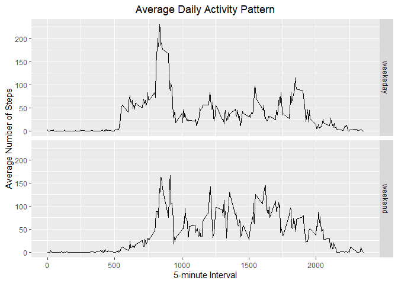

## Loading and preprocessing the data
Unzip the folder and read in the data in the activity.csv file.


```r
if (!file.exists('activity.csv')) {
  unzip(zipfile = "activity.zip")
}

activityData <- read.csv(file="activity.csv", header=TRUE)
```

```r
## What is mean total number of steps taken per day?
```

```r
# Calculate the total steps taken per day
totalSteps <- aggregate(steps ~ date, activityData, FUN=sum)

# Make a histogram of the total number of steps taken per day
hist(totalSteps$steps,
     main = "Total Steps per Day",
     xlab = "Number of Steps")
```

<!-- -->

```r
# Calculate and report the mean and median of total steps taken per day
meanSteps <- mean(totalSteps$steps, na.rm = TRUE)
medSteps <- median(totalSteps$steps, na.rm = TRUE)

#The mean steps taken per day is :
  meanSteps
```

```
## [1] 10766.19
```

```r
#Median Number of Steps Taken per Day is :
  medSteps
```

```
## [1] 10765
```

```r
## What is the average daily activity pattern?
```

```r
# Make a time-series plot of the 5-minute interval and the average number of
# steps taken, averaged acoss all days.
library(ggplot2)
meanStepsByInt <- aggregate(steps ~ interval, activityData, mean)
ggplot(data = meanStepsByInt, aes(x = interval, y = steps)) +
  geom_line() +
  ggtitle("Average Daily Activity Pattern") +
  xlab("5-minute Interval") +
  ylab("Average Number of Steps") +
  theme(plot.title = element_text(hjust = 0.5))
```

<!-- -->

```r
# Which 5-minute interval across all days contain the maximum number of steps
```

```r
# Which 5-minute interval across all days contain the maximum number of steps
maxInt <- meanStepsByInt[which.max(meanStepsByInt$steps),]

maxInt
```

```
##     interval    steps
## 104      835 206.1698
```

```r
## Imputing missing values
#Calculate and report the total number of missing values in the dataset by using:
```

```r
missingVals <- is.na(activityData$steps)
```

```r
#We see that, there are 17568 missing values. We would substitute these missing values with the 5-day mean of that respective interval.In the next steps, we formulate a strategy for filling in all of the missing values.
```

```r
# Create a new dataset that is equal to the original dataset but with 
# the missing data filled in.
imp_activityData <- transform(activityData,
                              steps = ifelse(is.na(activityData$steps),
                                             meanStepsByInt$steps[match(activityData$interval, 
                                                                        meanStepsByInt$interval)],
                                             activityData$steps))

# Make a histogram of the total number of steps taken each day and
# and report the mean and median.
impStepsByInt <- aggregate(steps ~ date, imp_activityData, FUN=sum)
hist(impStepsByInt$steps,
     main = "Imputed Number of Steps Per Day",
     xlab = "Number of Steps")
```

<!-- -->


```r
impMeanSteps <- mean(impStepsByInt$steps, na.rm = TRUE)
impMedSteps <- median(impStepsByInt$steps, na.rm = TRUE)
diffMean = impMeanSteps - meanSteps
diffMed = impMedSteps - medSteps
diffTotal = sum(impStepsByInt$steps) - sum(totalSteps$steps)
```

```r
## Are there differences in activity patterns between weekdays and weekends?
#Create a new factor variable in the dataset with two levels - "weekend" and "weekday"
```

```r
DayType <- function(date) {
  day <- weekdays(date)
  if (day %in% c('Monday', 'Tuesday', 'Wednesday', 'Thursday', 'Friday'))
      return ("weekeday")
  else if (day %in% c('Saturday', 'Sunday'))
      return ("weekend")
  else
      stop ("Invalid Date Format.")
}
imp_activityData$date <- as.Date(imp_activityData$date)
imp_activityData$day <- sapply(imp_activityData$date, FUN = DayType)

# Make a panel plot containnig a time-series plot of the 5-minute interval
# and the average number of steps taken across all weekdays or weekends
meanStepsByDay <- aggregate(steps ~ interval + day, imp_activityData, mean)
ggplot(data = meanStepsByDay, aes(x = interval, y = steps)) + 
  geom_line() +
  facet_grid(day ~ .) +
  ggtitle("Average Daily Activity Pattern") +
  xlab("5-minute Interval") +
  ylab("Average Number of Steps") +
  theme(plot.title = element_text(hjust = 0.5))
```

<!-- -->

```r
#Conclusion
#From the plot, we can conclude that there are differences in the number of steps taken during the weekend as compared to the weekdays.We have more steps taken in the weekdays than the weekend on average.
```
